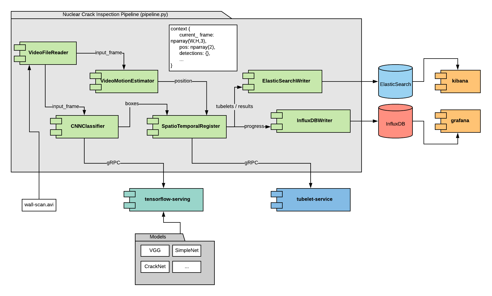

# nuclear-crack-inspection-pipeline (microservices)

**Abstract** : prototype implementation of a modular pipeline to localize, detect, and classify cracks in video footage for later querying using motion estimation, convolutional neural networks (CNN) and NoSQL databases. This is an attempt to reproduce the paper *Deep Learning-based Crack Detection Using Convolutional Neural Network and Naıve Bayes Data Fusion.* [1], but the approach is of interest for similar problems.

**Languages and tools:** Python, Tensorflow, Keras, OpenCV, ElasticSearch, InfluxDB, Grafana, Kibana.


## Overview

This implementation uses microservices. The main application service executes a pipeline of connected components components that consume other services to perform a specific need (ie: the CrackClassifier consumes a CNN model served in Tensorflow through gRPC, the SpatioTemporalRegister uses the tubelet-service to cluster the tubelets through gRPC, ElasticSearch is used to store them accesed using REST by ElasticSearchWriter, etc.) 



### Microservices

- Nuclear Crack Inspection Application: see details below.
- tensorflow-serving
- [tubelet-service](https://github.com/nhorro/tubelet-service)
- ElasticSearch
- Ifluxdb
- Grafana
- Kibana

### Pipeline implementation

Pipelines are built from Python components and currently execute in a single thread. Each component is initialized with a reference to a shared context (a Python dictionary) and can read and write data to this context. This is vaguely inspired in the [blackboard design pattern](https://en.wikipedia.org/wiki/Blackboard_(design_pattern)).

The pipeline works as following:

1. VideoFileReader grabs a frame and stores it as a numpy array in the "CURRENT_FRAME" entry in the context.
2. VideoMotionEstimator compares this frame against a local copy of the previous one and writes the current position estimation in the context.
3. The CNN classifier scans the image in search for cracks and stores the list of found boxes in the context.
4. The SpatioTemporalRegister uses the boxes and the position estimation to add observations to the tubelet-service. It also computes the filtered tubelets with Naive Bayes and adds them to the context.
5. ElasticSearchWriter writes the raw observations and filtered results to ElasticSearch.
6. InfluxDBWriter writes other statistics to InfluxDB (current frame, presence of cracks, etc)

This is repeated for each frame.

## Instructions for quick development setup

### Running services

Step 1. Run ElasticSearch, InfluxDB, Grafana, Kibana and Video Streamer services.

```bash
cd services
./up.sh
```

Step 2. Serve a ML model.

```bash
export SERVING_MODEL=febrero-cpu-friendly_weights
export DOCKER_SERVICE_NAME=cracks-classifier-service
```

Option 1) with CPU:

```bash
docker run -t --rm -p 8501:8501 -p 8500:8500 -v $(realpath $PWD/models):/models --name $DOCKER_SERVICE_NAME -e MODEL_NAME=$SERVING_MODEL tensorflow/serving:1.12.0
```

Option 2) with GPU:

```bash
docker run -t --rm --runtime=nvidia -p 8501:8501 -p 8500:8500 -v $(realpath $PWD/models):/models --name $DOCKER_SERVICE_NAME -e MODEL_NAME=$SERVING_MODEL tensorflow/serving:1.12.0-gpu
```

Step 3. Run development docker.

```bash
docker run -it --rm --runtime=nvidia -v $(realpath $PWD):/tf/notebooks --name tensorflowdev1 --network="host" nhorro/tensorflow1.12-py3-jupyter-opencv:latest
```

### Monitoring output

Video feed: http://localhost:5000/video_feed

Grafana: http://localhost:3000

Kibana: http://localhost:5601

### Grafana configuration

TODO

### Kibana configuration

TODO

## Project organization

```
./
|-downloads
|-media
|-services
|-misc
|-models
	|-faster_rcnn_resnet50_coco
	|-simplenet_cracks8020
	|-cracknet
|-src
	|-components
	|-notebooks
	|-pipelines
		|-
README.md

```

TODO

## References

- [1] Chen, Fu-Chen & Jahanshahi, Mohammad. (2017). NB-CNN: Deep Learning-based Crack Detection Using Convolutional Neural Network and Naïve Bayes Data Fusion. IEEE Transactions on Industrial Electronics. PP. 1-1. 10.1109/TIE.2017.2764844.
- [2] Özgenel, Çağlar Fırat (2018), “Concrete Crack Images for Classification”, Mendeley Data, v1http://dx.doi.org/10.17632/5y9wdsg2zt.1