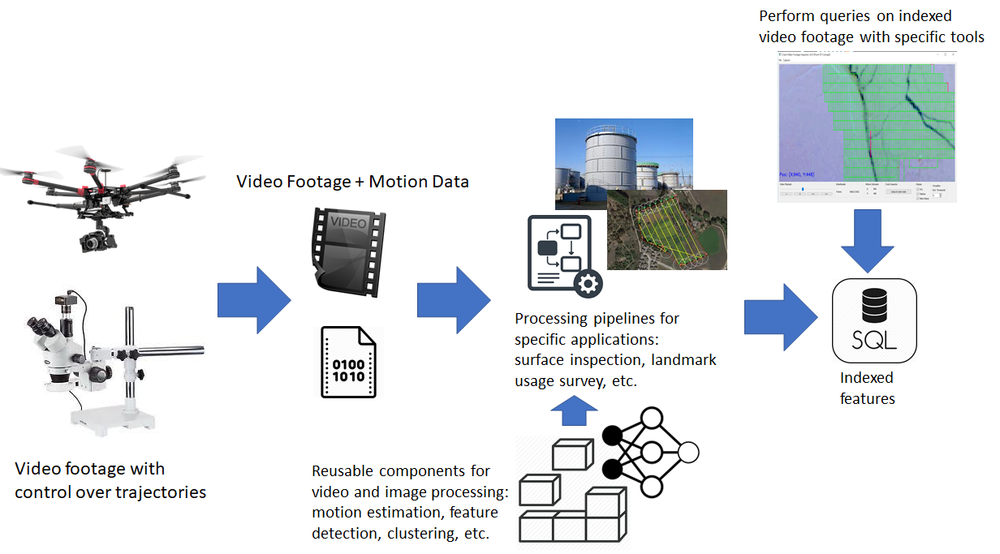
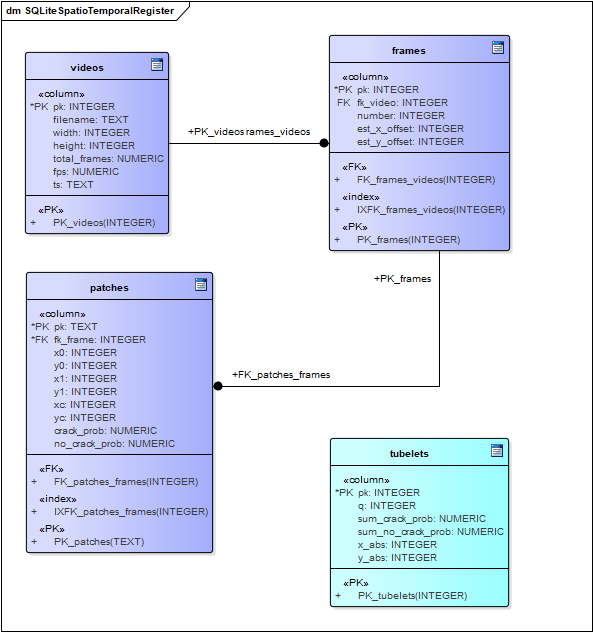
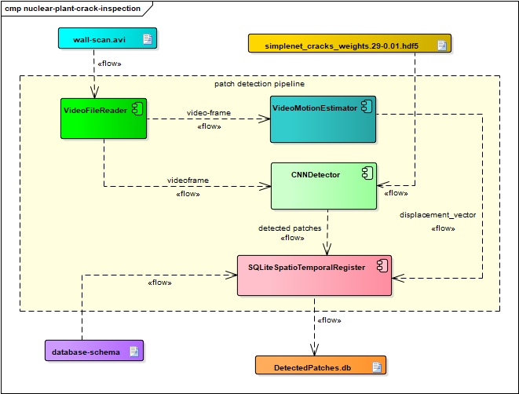
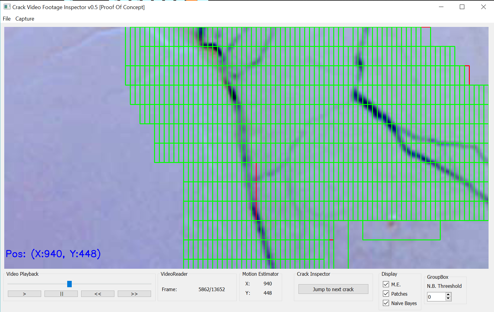

# Crack inspection processing pipeline

**Abstract** : prototype implementation of a modular pipeline to localize, detect, and classify cracks in video footage for later SQL querying using motion estimation, convolutional neural networks (CNN) and relational/spatial databases. This is an attempt to reproduce the paper *Deep Learning-based Crack Detection Using Convolutional Neural Network and Naıve Bayes Data Fusion.* [1], but the approach is of interest for similar problems.

**Languages and tools:** Python, Tensorflow, Keras, OpenCV, SQLite.


## Introduction

Nowadays it is well established the use of relational, document, graph, time series, key-value and other database types to store information and perform advanced queries on it .

This capability, however is most of the time not available as a COTS for non-structured data such as video footage, audio or text.

This work attempts to provide a library of reusable components for fast prototyping of applications that need to obtain information from video footage, with a special focus on aerial footage obtained by drones and footage for surface inspection that can be obtained with a moving camera over a rail.

A special application for inspection of cracks in a nuclear plant [1] is implemented to guide the design and test the applicability of the solution.

### Workflow

In a typical scenario, video footage may be obtained from a camera carried on a robot or a moving arm. This is the case in a CCTV system for wall inspection in the tank of a nuclear plant, a drone flying over a region to perform a landmark use survey, or a small arm inspecting a PCB to detect manufacture flaws.



This framework provides reusable components common to many image and video processing applications in order to ease the definition of processing pipelines. The collective maintenance and development of these components with a standardized decoupled interface could be beneficial for a people working in different projects that share the need of a processing chain.

The desired product of each pipeline is an indexed database that can be used to navigate the footage, and seek frames of special interest by the use of queries in a high level language such as SQL.

Example queries:

- Where are major cracks in the surface of a nuclear reactor tank?
- How many objects of type T were inside polygon P(p0,p1,..pN) between time t0 and t1 ?
- Where are objects of type T concentrated?
- Is there any missing object in the scene? When was it removed?
- Was any anomaly found in the inspection of 100 PCBs?

## Framework description

### Project organization

Project at its actual status is organized as follows:

- **A library of reusable components** for motion estimation, spatiotemporal registering, CNN detectors, etc. 
- **Tools**: scripts and GUI tools for generating test media or analyzing intermediate and/or work with final products.
- **Trained models**: exported as checkpoints or Tensorflow SavedModels.
- **Pipelines**: scripts with processing pipelines for specific applications.
- **Data**: video footage to test pipelines and models and results of of different proces.
- **Products**: final and intermediate products generated in different stages of a processing pipeline: DB files, CSVs, generated video, etc.

## Component Library

### Video

Components to wrap the OpenCV methods to read video from a file one frame at a time and write encoded video.

### VideoMotionEstimator

Component to estimate the displacement vector from a sequence of frames. Used when IMU/GPS information is not available (ie: to integrate in already existent manned CCTV surface inspection systems).

| Algorithm             | Input Type | Possible Applications                                        | Constraints                                                  | Output                                      |
| --------------------- | ---------- | ------------------------------------------------------------ | ------------------------------------------------------------ | ------------------------------------------- |
| Phase correlation     | 2D Video   | Surface inspection. Registration of objects in drone aerial footage. | Only translational movements. Camera must be at a constant distance from surface. | 2D displacement vector.                     |
| OpenCV Block Matching | 2D Video   | Surface inspection. Registration of objects in drone aerial footage. | Only translational movements. Camera must be at a constant distance from surface. | 2D displacement vector.                     |
| OpenCV Optical Flow   | 2D Video   | Registration of objects in drone aerial footage.             | Should be complemented with other IMU information to achieve better accuracy. | 3D displacement vector and attitude vector. |

Note:

- WIP: OpenCV Block Matching / OpenCV Optical Flow 

### CNNDetector models

Each CNN detector takes an input RGB encoded image and outputs the probability of that image matching a known class. Output classes are defined on training and depend on the training dataset.

See [models for crack classification](https://github.com/nhorro/tensorflow-crack-classification)

### SQLiteSpatioTemporalRegister

Component to register CNNDetector results in space and time. Location information is obtained from VideoMotionEstimator or other source such as IMU log.

Tubelet and cluster tables are populated after patches for all frames are processed.

#### Database relational model



Notes:

- This diagram represents the relational model for the crack detection pipeline.

- Estimated x_offset and y_offset may be generalized to displacement vector.

- crack_prob and no_crack_prob may be generalized to "class1_prob", "class2_prob", etc.


### Pre-built pipelines

| Pipeline  | Description                                                  |
| --------- | ------------------------------------------------------------ |
| crackcnn  | Detect cracks in surfaces such as walls. Inspired in [NB-CNN] for crack inspection surfaces of nuclear tanks. |

#### crackcnn - pipeline for crack inspection in nuclear plant

This pipeline attempts to reproduce [1]. 

TODO:

- Differences with original paper.

##### Stage 1 -Patch Classification



##### Stage 2 - Spatio Temporal Clustering and Naive Bayes decision making

Once all frames have been scanned tubelets aggregate all the observations for a same region and store the sum of positive and negative observations for that region. This can be accomplished by a single SQL statement:

```sqlite
INSERT INTO tubelets(q,sum_crack_prob,sum_no_crack_prob,x_abs,y_abs)
SELECT 
count(*) as q,
sum(crack_prob) as sum_crack_prob,
sum(no_crack_prob) as sum_no_crack_prob,
(frames.est_x_offset+patches.xc) as x_abs,
(frames.est_y_offset+patches.yc) as y_abs
from patches 
join frames on patches.fk_frame = frames.pk
group by x_abs,y_abs
```

This approach is easy to implement but has the caveat that clusters are defined by fixed values of X and Y and not by the distance to a centroid, Algorithm ST-DBSCAN can be a better solution.

A region is classified as having a crack for a selection threshold if the following relation is satisfied:


\begin{equation}
{
	\log \sum{ P(C_{crck}|s_1,..,s_n}  )
 	\over  
 	\log(\sum{ P(C_{ncrck}|s_1,..,s_n} )
 } \ge \theta
\end{equation}

TODO: 

- implement all decision making conditions from paper
- how to choose theta ? 
- Export ground truth table generated from human analysis and use this table to find threshold value as described in [1].

## Additional tools

### img2panvideo

Python command line script to generate a panning video from a high resolution image to simulate the video of a moving camera scanning a surface when actual footage is not available.

| Parameter      | Type/Unit    | Description                                                  |
| -------------- | ------------ | ------------------------------------------------------------ |
| input          | string       | Input image filename.                                        |
| width          | pixels       | Output video frame with in pixels.                           |
| height         | pixels       | Output video frame height in pixels.                         |
| scan_speed_x   | pixels/frame | Horizontal displacement per frame.                           |
| return_speed_x | pixels/frame | Horizontal displacement per frame when returning to horizontal starting point. |
| speed_y        | pixels/frame | Vertical displacement per frame.                             |
| stride_y       | pixels       | Vertical offset between each horizontal scan.                |
| output         | string       | Generated video filename.                                    |

##### Usage example

```bash
python img2panvideo.py --input "grieta.jpg" --width 400 --height 400 --scan_speed_x 10 --return_speed_x 20 --speed_y 30 --stride_y 40 --output "wall_scan.avi"
```

### crackvideoinspector

GUI application to visualize detections in video footage.



TODO:

- Mechanism to input corrections on patch predictions and store in DB to train NB, retrain CNN Detector.


## Command line recipes

### Run the crack-pipeline

- Step 1. Edit jobs.json. For example to process 'wall-scan-example':

```json
{
	"jobs": {
		"wall-scan-example": {
			"input_video": "../../../data/footage/wall-scan.avi",
			"start_frame": 0,
			"limit": 0,
			"checkpoint_model": "../../../model-checkpoints/febrero-cpu-friendly_weights.27-0.01.hdf5",
			"stride": 16,
			"patch_size": 64,
			"spr_output_filename": "../../../products/spr/{name}_{checkpoint_model}_{date}.db"
		}
	}
}
``` 

- Step 2. For example, to execute 'wall-scan-slow' with docker [custom-tensorflow1.12-py3-jupyter-opencv](tensorflow1.12-py3-jupyter-opencv):

```bash
docker run -it --rm --runtime=nvidia -v $(realpath $PWD):/tf/notebooks --name tensorflowdev1 --network="host" -p 8888:8888 custom-tensorflow1.12-py3-jupyter-opencv bash
cd /tf/notebooks/src/pipelines/crackcnn
python crackcnnpipeline.py --jobs=jobs.json --name=wall-scan-example
```

## References

- [1] Chen, Fu-Chen & Jahanshahi, Mohammad. (2017). NB-CNN: Deep Learning-based Crack Detection Using Convolutional Neural Network and Naïve Bayes Data Fusion. IEEE Transactions on Industrial Electronics. PP. 1-1. 10.1109/TIE.2017.2764844.
- [2] Özgenel, Çağlar Fırat (2018), “Concrete Crack Images for Classification”, Mendeley Data, v1http://dx.doi.org/10.17632/5y9wdsg2zt.1

